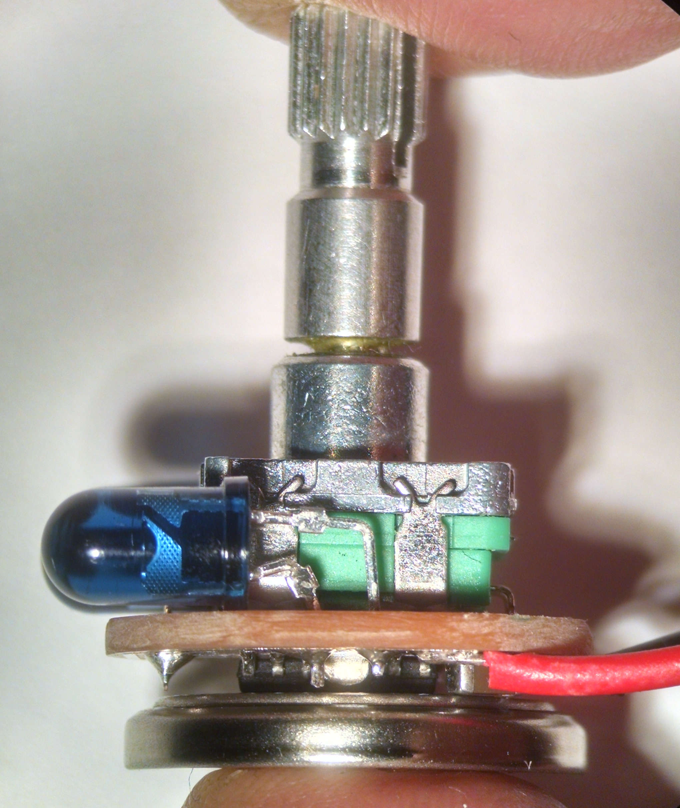
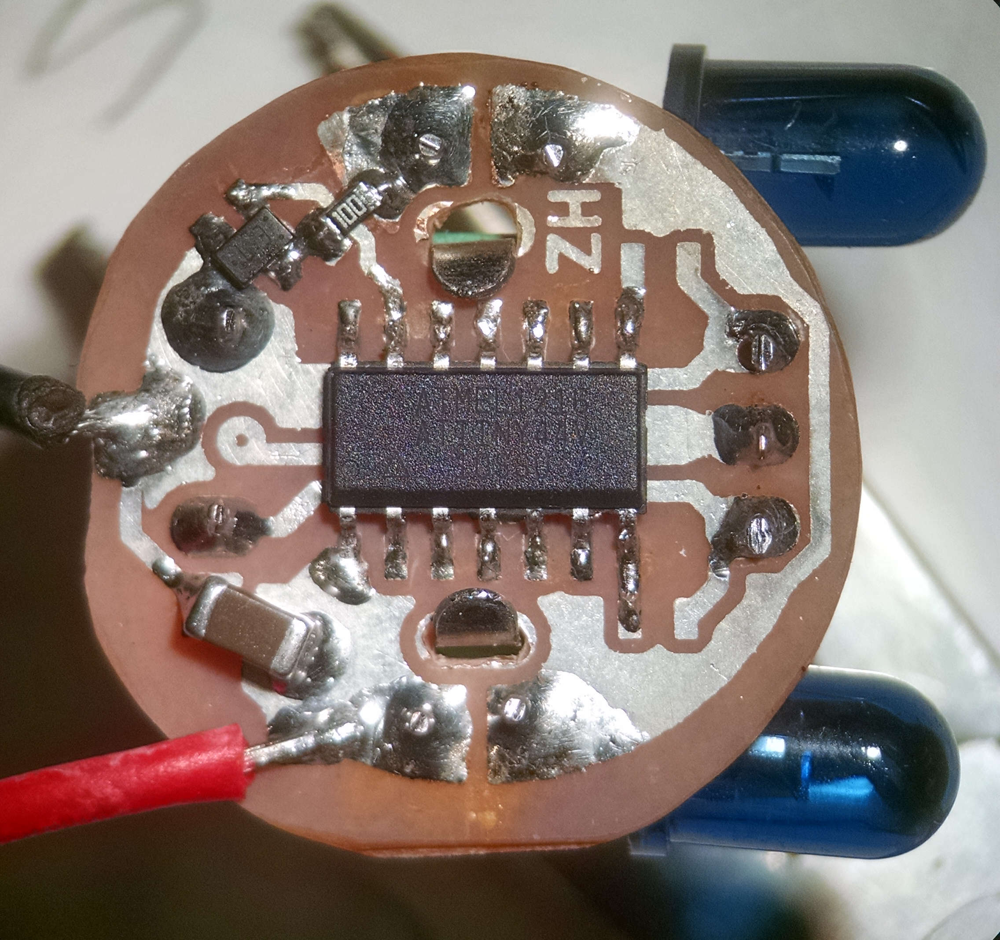
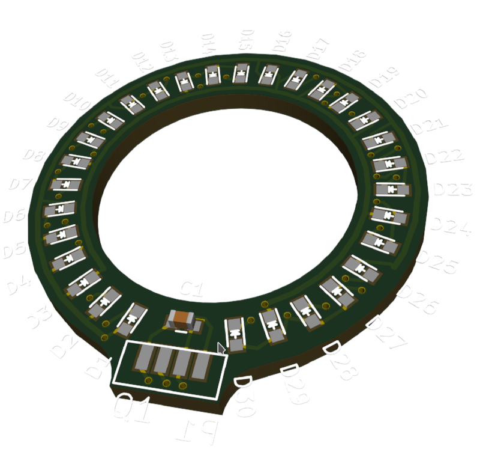
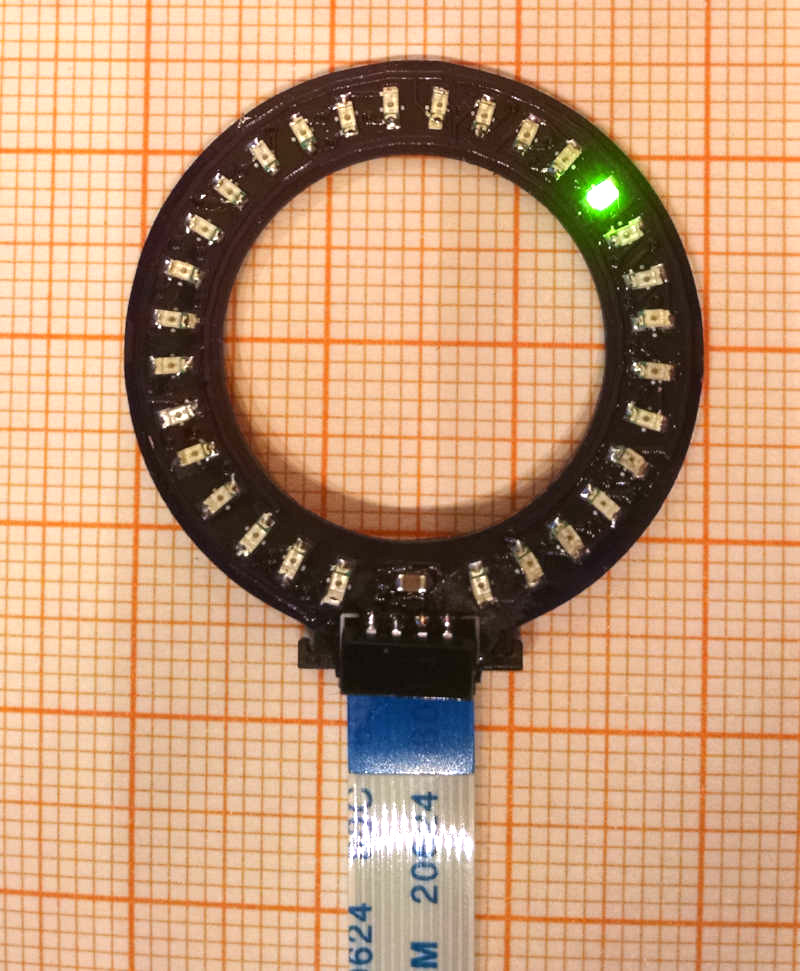

Remote controlled volume knob
=============================

_**Knopf, der** German: button, knob (Pronounciation: /knɔpf/)_

A project to upgrade an amplifier volume knob from a simple regular
potentiometer to a digital one that still can be controlled
directly at the amplifier but also via an infrared remote control.

Replaces the regular potentiometer with a [DS1882] and a rotational encoder.
Visual feedback with a charlie-plexed LED ring.

The interesting part is the infrared remote control: another rotational encoder,
with an infrared transmitter: a wireless extension of the volume knob.

The rotational encoders have a secondary push-button function which is used to
enable muting. Another press on that button will un-mute and go back to the
original volume.

# Remote control sender
The [sender](./pcb/remote-control) is a 20mm round PCB and thus roughly the
size of the volume knob and the diameter of a CR2032 battery.

Provides a rotational encoder with an integrated button (used for 'mute'), two
Infrared LEDs to send.
Microcontroller: Attiny44. Quiescent current: < 0.2 μA. Runs on CR2032.

Top                    | Side                       | Bottom
-----------------------|----------------------------|--------------------------
||

TODO: build acryilic housing.

Code in [sender/](./sender) directory.

# DigiPot Receiver

The [receiver](pcb/digi-pot) behaves like a logarithmic stereo potentiomter.
It takes an input signal from a local rotational encoder or the infrared
signal (amplified and prepared with a Vishay TSOP75338).
It provides two 'potentiometer' outputs. The local encoder has a 32 step/turn
resolution of which 30 are used (to have a visual 'gap' between min and max
like in a regular pot).

Microcontroller: Attiny48.
Runs on +5V (digital processing) and +/-6V (Analog). For these voltge rails,
there is a little separate [power supply PCB](./pcb/power)

Code in [receiver/](./receiver) directory.

Render                      |  Bottom                      | Shallow side view
----------------------------|------------------------------|----------------------------|
| (This early revision required some bodge resistors)||

# LED Ring
The [LED ring](./pcb/led-ring) is mounted on the front-panel of the amplifier
around the volume knob. In this case, this is a 19mm knob, so the ring is 20mm.

It contains 30 charlie-plexed LEDs to display the current 'position' and the
TSOP IR module. On mute, the current volume position is blinking (controlled by
the [DigiPot](./pcb/digi-pot)).

The round board connects with the main receiver board via a 12 connect,
0.5mm pitch flat flex cable.

Render                       | Real
-----------------------------|----------------------
 | 

[DS1882]: https://datasheets.maximintegrated.com/en/ds/DS1882.pdf