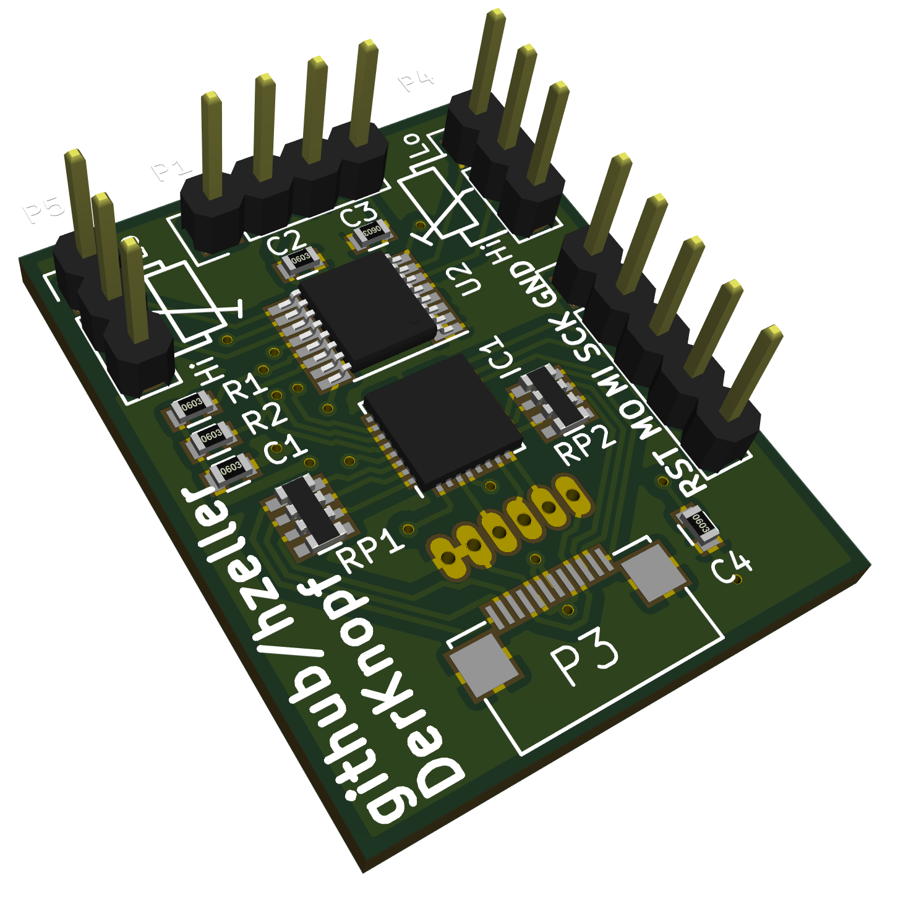

DigiPot
=======

The actual simulated pot with connectors for the LED ring, the IR receiver and
a local optical

## BOM

 * 2x 4.7k 0603 resistor
 * 4x 100n 0603 capacitor
 * 2x (4x75 Ohm) resistor network.
 * 1x Attiny48
 * 1x DS1882
 * 1x CUI C14D32P-A3 optical encoder.

