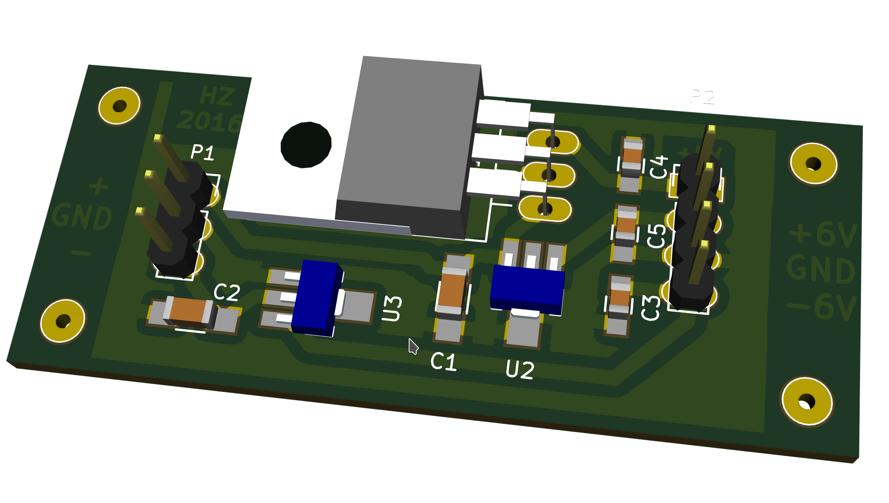

Power supply
============

The DigiPot needs 5V for digital operation and +/- 6V for the analog part.
Assuming that we already have some symmetric power in the amplifier, this
creates the necessary voltages. The current demands on the analog rails are
miniscule, so small SOT89-3 are sufficient for the task.

The 5V rail needs something in the 30mA range (operate microcontroller,
LEDs on LED ring and optical encoder), so depending on the input
voltage that could be some noticeable generated heat, hence we use a TO220 case.

Single sided board for simple home-etching.

## BOM

 * 1x 78L06 SOT89-3
 * 1x 79L06 SOT89-3
 * 1x 7805 TO220
 * 3x 100n capacitor, 0805
 * 2x 10uF ceramic capacitor, 50V, 1206

