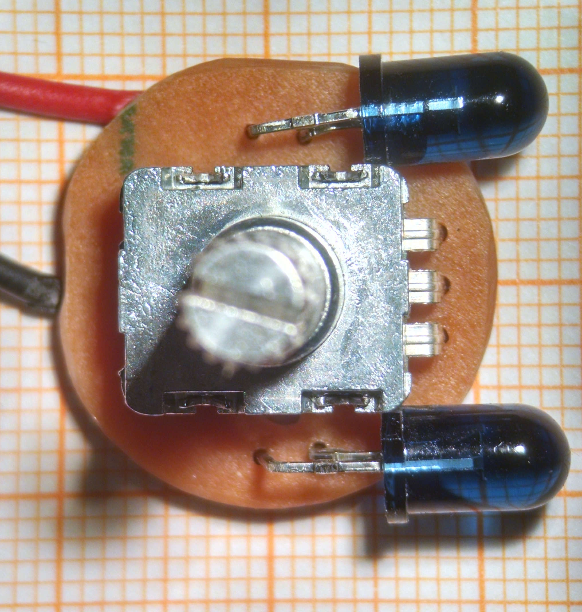
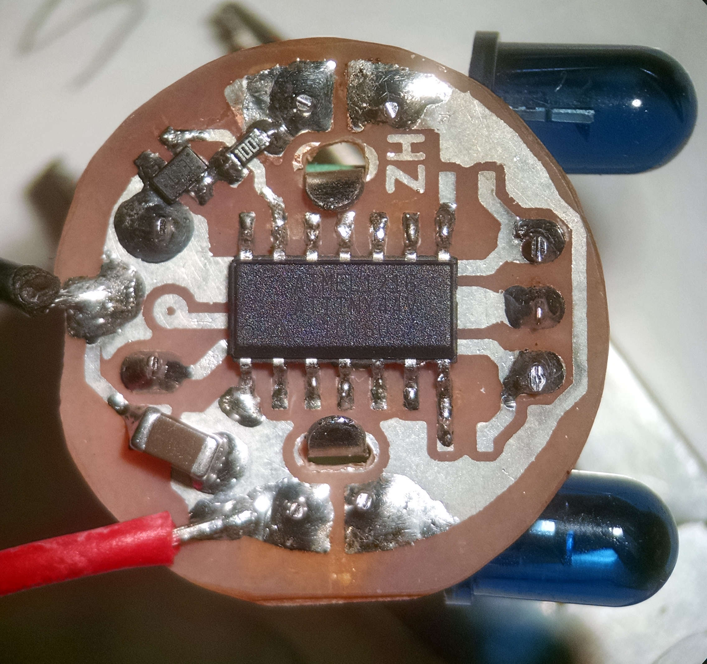
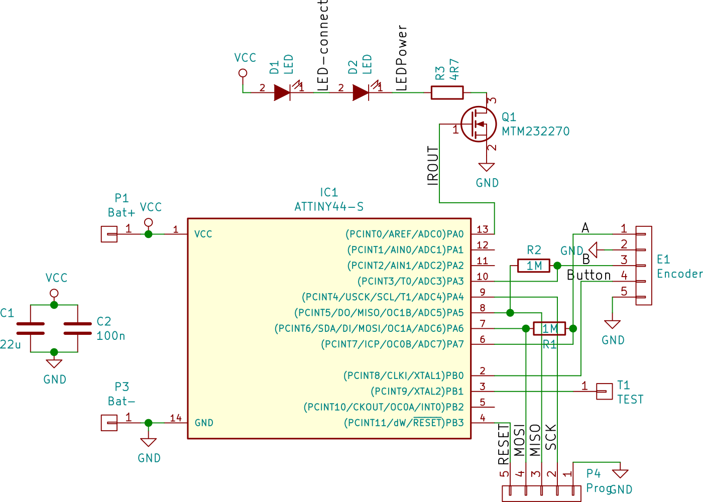

Remote Control
==============

The remote control, operated with an Attiny44 on a CR2032 battery. Processor
gets woken up from power down state on state change of the inputs, so quiescent
current is less than 0.2 μA.

It is not clear yet if the CR2032 increase in internal resistance over time will
be sufficient for our desired peak-current of 120mA through the IR LEDs (only
partially on, so average current ~40mA). So future revisions might consider
adding some electrolytic capacitors (but we'd need > 4700uF to power one
transmit of about 64ms * 40mA * 3V ~= 8mJ), or changing the battery (CR2450 or
even two AAA or AAAA).

With optional 1M pullups for the mechanical encoder, as these sometimes get
stuck in some half position, draining current through the pull-ups. The
standard pullups inside the attiny are aorund 60k (Note: this feature is not
used in the assembly below, just using the internal resistors.)

The programming header shown in the schematic does not have a component
associated on the board as it was too bulky.

Single-sided board for simple home-etching.

## BOM
  * 1x rotational encoder with push-button (here: EN11-HSB1AQ20, but might consider EN11-HSM1AF15 in the future for better mounting. See [EN11-datasheet])
  * 1x Attiny44
  * 1x 22μF ceramic capacitor (1206)
  * 1x 100n ceramic capacitor (0603)
  * 2x 1M resistor (0603)
  * 1x 4.7Ohm resistor (0805)
  * 1x MTM232270 N-channel Mosfet (SOT-323)

Top                    | Side                       | Bottom
-----------------------|----------------------------|--------------------------
||

[EN11-datasheet]: http://www.bitechnologies.com/pdfs/en11.pdf